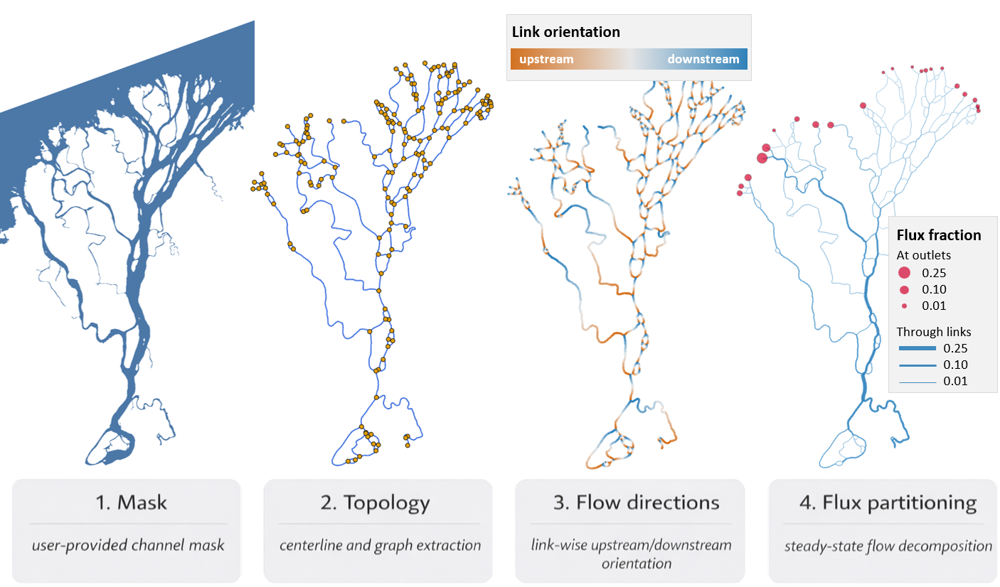

# RivGraph

RivGraph is a Python package for converting a binary mask of a channel network into a directed, weighted graph of connected links and nodes. It is designed for river and delta channel networks derived from remote sensing imagery and geospatial masks.

## Core capabilities

- morphologic metrics such as widths, lengths, and branching characteristics
- graph-based and algebraic representations of channel networks
- topologic and dynamic metrics such as alternative paths, flux sharing, and entropy-based measures
- tools for cleaning and preparing binary channel masks
- island detection, metrics, and filtering
- mesh generation for along-river analysis
- geospatial export of links, nodes, rasters, and derived products

RivGraph preserves georeferencing information throughout the workflow. If you start with a georeferenced mask, exported rasters and vectors remain aligned with the source data and can be used directly in GIS workflows.

The flow-directionality logic and validation are described in our [ESurf Dynamics paper](https://www.earth-surf-dynam.net/8/87/2020/esurf-8-87-2020.html). General package usage is described in our [JOSS paper](https://joss.theoj.org/papers/10.21105/joss.02952).

## Getting started

Start with the [documentation](https://VeinsOfTheEarth.github.io/RivGraph/) and the notebooks in `examples/`. RivGraph contains two primary classes, `delta` and `river`, that organize the main processing workflows. These notebooks show the end-to-end usage patterns:

- `examples/delta_example.ipynb`
- `examples/braided_river_example.ipynb`
- `examples/mouse_brain_example.ipynb`

## Use of AI

RivGraph was initially released before the advent of LLMs and thus v0.5.0 was written entirely without AI assistance. However, the v1.0 release was made possible through efficiencies provided by relying heavily on AI coding (mainly OpenAI tools). 

## Contributing

Bug reports, documentation improvements, and pull requests are welcome. The easiest way to start is to open an issue in the [tracker](https://github.com/VeinsOfTheEarth/RivGraph/issues).

## Citing RivGraph

If you use RivGraph in your research, please consider [citing it](https://joss.theoj.org/papers/10.21105/joss.02952).

If you use RivGraph's flow-directionality algorithms, please cite our [ESurf Dynamics paper](https://www.earth-surf-dynam.net/8/87/2020/esurf-8-87-2020.html).

If you use RivGraph's flux paritioning scheme that asssumes steady-state, width-weighted fluxes at junctions, you should be aware of [this work](https://agupubs.onlinelibrary.wiley.com/doi/pdfdirect/10.1029/2022GL097897).

## License

RivGraph is distributed under the [BSD 3-clause license](LICENSE.txt).
