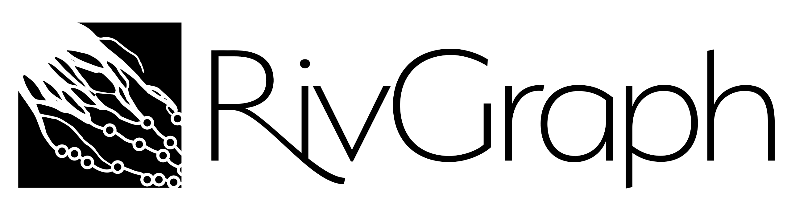
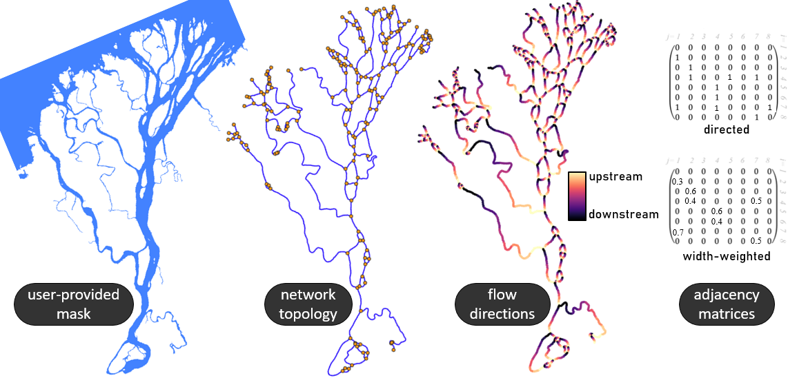

[](https://doi.org/10.21105/joss.02952)

[](https://VeinsOfTheEarth.github.io/RivGraph/ "Go to documentation.")

About
-----

RivGraph is a Python package for converting a binary mask of a channel network into a directed, weighted graph of connected links and nodes.



Core capabilities include:

- morphologic metrics such as widths, lengths, and branching characteristics
- algebraic and graph-based representations of channel networks
- topologic and dynamic metrics such as alternative paths, flux sharing, and entropy-based measures
- tools for cleaning and preparing binary channel masks
- island detection, metrics, and filtering
- mesh generation for along-river analysis

RivGraph preserves georeferencing information throughout the workflow. If you start with a georeferenced mask, exported rasters and vectors remain aligned with the original data and can be used directly in GIS workflows.

The flow-directionality logic and validation are described in our [ESurf Dynamics paper](https://www.earth-surf-dynam.net/8/87/2020/esurf-8-87-2020.html). General package usage is described in our [JOSS paper](https://joss.theoj.org/papers/10.21105/joss.02952). Canonical runnable examples live in:

- `examples/delta_example.ipynb`
- `examples/braided_river_example.ipynb`
- `examples/mouse_brain.ipynb`

Installing
----------

If you just want to use RivGraph, install the conda-forge package into a fresh environment:

```bash
conda create -n rivgraph_env rivgraph -c conda-forge
conda activate rivgraph_env
```

If you want to develop, test, or build documentation from source, use the repository environment file first and then perform an editable install:

```bash
conda env create -f environment.yml
conda activate rivgraph-modern
pip install -e . --no-deps
```

`environment.yml` is the canonical source/development environment. `environment-modern.yml` is kept as a transition alias and should match it.

Using `--no-deps` is intentional here: the geospatial stack is managed by the conda environment file, which avoids pip trying to re-resolve compiled dependencies that are already pinned in conda.

To verify a source install, run:

```bash
pytest -ra
```

For a quicker smoke test, run:

```bash
pytest -ra tests/test_geospatial_roundtrip.py tests/regression
```

Building the docs
-----------------

Install the documentation extras into the same activated environment:

```bash
pip install -e ".[docs]"
```

Then build the HTML docs:

```bash
python -m sphinx -b html docs/source docs/build/html
```

Open `docs/build/html/index.html` in a browser.

How to use RivGraph
-------------------

Start with the [documentation](https://VeinsOfTheEarth.github.io/RivGraph/) and the notebooks in `examples/`.

RivGraph requires a binary mask of the channel network. The [maskmaking guide](https://VeinsOfTheEarth.github.io/RivGraph/maskmaking/index.html) provides practical guidance on obtaining, cleaning, and georeferencing masks.

RivGraph contains two primary classes, `delta` and `river`, that organize the main processing workflows. The notebooks show the end-to-end usage patterns, while the API docs are generated from the source docstrings.

Contributing
------------

We welcome feature requests, bug reports, documentation improvements, and code contributions. The simplest way to start is to open an issue in the [tracker](https://github.com/VeinsOfTheEarth/RivGraph/issues).

Citing RivGraph
---------------

Citations help justify the effort that goes into building and maintaining this project. If you used RivGraph in your research, please consider citing it.

If you use RivGraph's flow-directionality algorithms, please cite our [ESurf Dynamics paper](https://www.earth-surf-dynam.net/8/87/2020/esurf-8-87-2020.html). If you publish work that uses RivGraph more generally, please also cite our [JOSS paper](https://joss.theoj.org/papers/10.21105/joss.02952).

Contact
-------

The best way to get in touch is to [open an issue](https://github.com/VeinsOfTheEarth/RivGraph/issues/new) or comment on an open issue or pull request.

License
-------

RivGraph is distributed under the BSD 3-clause license. A copy is provided in [LICENSE.txt](LICENSE.txt).
