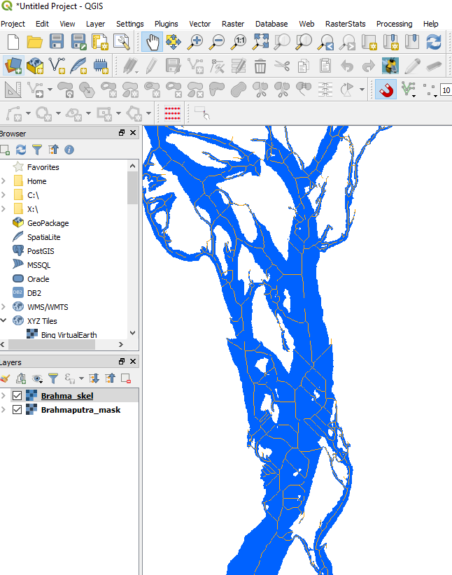
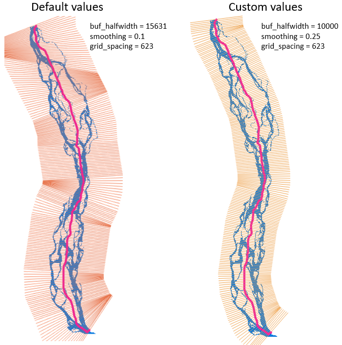
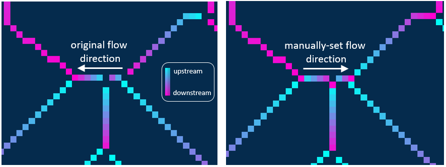

Brahmaputra braided-river example
=================================

This page is a guide to the canonical river notebook rather than a second, independently maintained tutorial.
For the full runnable workflow, open:

::

   examples/braided_river_example.ipynb

Dataset and paths
-----------------

The example uses the Brahmaputra sample data shipped with the repository:

::

   examples/data/Brahmaputra_Braided_River/

The notebook writes outputs to:

::

   examples/data/Brahmaputra_Braided_River/Results/

What the notebook covers
------------------------

The notebook walks through the standard braided-river workflow:

1. instantiate :class:`rivgraph.classes.river`
2. skeletonize the binary mask
3. compute the links and nodes
4. prune the network
5. compute widths and lengths
6. compute a centerline and mesh
7. assign flow directions
8. export georeferenced outputs and inspect results

Required inputs for river workflows
-----------------------------------

A river workflow needs:

- a binary mask, preferably a georeferenced GeoTIFF in a projected CRS
- ``exit_sides`` when constructing the river class so RivGraph knows the upstream and downstream image edges

Unlike deltas, rivers do not require shoreline or inlet-node vector files.

Current export behavior
-----------------------

In the refactored v1 workflow, :meth:`rivgraph.classes.rivnetwork.to_geovectors` defaults to GeoPackage
(``ftype='gpkg'``). GeoJSON export is still supported, but it requires EPSG:4326 coordinates unless you pass
``reproject=True``. Shapefile export remains available but is the least capable option because of field-name and
schema limitations.

Related documentation
---------------------

- :doc:`../../quickstart/index`
- :doc:`../../maskmaking/index`
- :doc:`../../apiref/rivgraph`
- :doc:`../../apiref/rivers`

Selected views from the example
-------------------------------

   The georeferenced mask and skeleton loaded in QGIS.

   Example centerline/mesh output for the braided-river workflow.

   Example of manual inspection and correction of flow directions.
