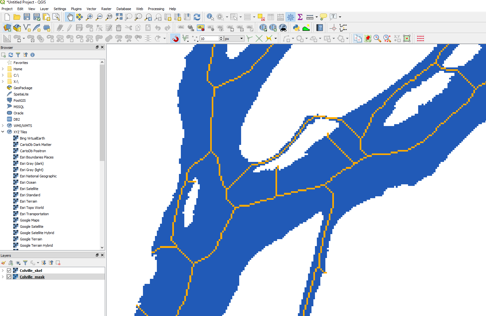
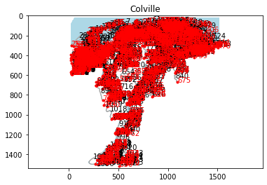

Let’s demo RivGraph on the Colville Delta!
------------------------------------------

This demo shows some of the core functionality and convenient plotting
and exporting features provided by RivGraph for analyzing delta channel
networks. The basic steps of RivGraph include:

1. Instantiate delta class
2. Skeletonize the binary mask
3. Compute the network (links and nodes)
4. Prune the network (requires user-created shoreline and input nodes
   for deltas)
5. Compute morphologic metrics (lengths, widths)
6. Assign flow directions for each link.
7. Compute some topologic metrics.

Along the way, we’ll export some geotiffs and GeoJSONs (or shapefiles if
you prefer) for inspection in QGIS. RivGraph requires a **binary mask of
the channel network**, preferably georeferenced (i.e., a GeoTiff). For
deltas, you will also need to create two shapefiles/GeoJSONs: one of the
**shoreline**, and one of the **inlet nodes**. See section 4 for
guidance on how to create these required geovector files.

1. Instantiate delta class
~~~~~~~~~~~~~~~~~~~~~~~~~~

.. code:: ipython3

    from rivgraph.classes import delta
    import matplotlib.pyplot as plt

    # Define the path to the georeferenced binary image.
    mask_path = "./data/Colville_Delta/Colville_mask.tif"

    # Results will be saved with this name
    name = 'Colville'

    # A folder called Colville will be created within this path for storing outputs
    results_folder = './data/Colville_Delta/Results'

    # Boot up the delta class! We set verbose=True to see progress of processing.
    colville = delta(name, mask_path, results_folder=results_folder, verbose=True)

    # The mask has been re-binarized and stored as an attribute of colville:
    plt.imshow(colville.Imask)

.. parsed-literal::

    <matplotlib.image.AxesImage at 0x273d8f8e3a0>

.. image:: output_2_1.png

2. Skeletonize the binary mask
~~~~~~~~~~~~~~~~~~~~~~~~~~~~~~

.. code:: ipython3

    # Simply use the skeletonize() method.
    colville.skeletonize()

    # After running, colville has a new attribute: Iskel. Let's take a look.
    plt.imshow(colville.Iskel)

.. parsed-literal::

    Skeletonizing mask...done.

.. parsed-literal::

    <matplotlib.image.AxesImage at 0x273d790afd0>

.. image:: output_4_2.png

The skeleton is hard to see; perhaps we’d like to look at it closer? One
option is to save it as a geotiff and pull it up in a GIS (like QGIS).

.. code:: ipython3

    # We use the write_geotiff() method with the "skeleton" option.
    colville.to_geotiff('skeleton')

.. parsed-literal::

    Geotiff written to data\Colville_Delta\Results\Colville_skel.tif.

The georeferenced Colville skeleton has been written to disk, so we can
pull it up in QGIS along with the georeferenced mask:

.. figure:: images/colville_qgis_mask_skel_large.png
   :alt: colville_qgis_mask_skel_large.PNG

   colville_qgis_mask_skel_large.PNG

Or a bit zoomed-in:

   colville_qgis_mask_skel_zoom.PNG

3. Compute the network (links and nodes)
~~~~~~~~~~~~~~~~~~~~~~~~~~~~~~~~~~~~~~~~

.. code:: ipython3

    # Simply use the compute_network() method.
    colville.compute_network()

.. parsed-literal::

    Resolving links and nodes...done.

.. code:: ipython3

    # Now we can see that the "links" and "nodes" dictionaries have been added as colville attributes:
    links = colville.links
    nodes = colville.nodes
    print('links: {}'.format(links.keys()))
    print('nodes: {}'.format(nodes.keys()))

.. parsed-literal::

    links: dict_keys(['idx', 'conn', 'id', 'n_networks'])
    nodes: dict_keys(['idx', 'conn', 'id'])

The *links* dictionary currently contains four keys: - idx: a list of
all the pixel indices that make up the link (indices created with input
mask shape and np.ravel_multi_index) - conn : a two-element list
containing the node *id*\ s of the link’s endpoints - id: each link has
a unique *id*; the ordering is irrelevant - n_networks: the number of
disconnected networks (==1 if the input mask contains a single connected
blob)

The *nodes* dictionary currently contains three keys: - idx: the index
of the node’s position within the original image
(i.e. np.ravel_multi_index()) - conn: an N-element list containing the N
link *id*\ s of the links connected to this node. - id: each node has a
unique *id*; the ordering is irrelevant

We can visualze the network in a couple of ways. First, we can plot with
matplotlib:

.. code:: ipython3

    colville.plot('network')

Nodes and links are labeled with their ids. Kind of hard to see, so we
can zoom in OR we can export the network to geovectors and pull ’em into
QGIS:

.. code:: ipython3

    colville.to_geovectors('network', ftype='json') # ftype can be either 'shp' or 'json'

    # Let's see where the network geovector files were written:
    print(colville.paths['links'])
    print(colville.paths['nodes'])

.. parsed-literal::

    data\Colville_Delta\Results\Colville_links.json
    data\Colville_Delta\Results\Colville_nodes.json

And dragging these into QGIS: |colville_network_unpruned.PNG| You can
query different links and nodes using the Identify tool. Note that their
properties (‘conn’ and ‘id’) are appended.

.. |colville_network_unpruned.PNG| image:: images/colville_network_unpruned.png

4. Pruning the network
~~~~~~~~~~~~~~~~~~~~~~

You notice in the above image that there are many superfluous links
along the shoreline. This is a result of skeletonizing such a massive,
connected waterbody (i.e. the ocean in this case). Additionally, the
network contains a number of “dangling” links, or those that are
connected only at one end. We want to keep the inlet and outlet dangling
links, but not the others! RivGraph will automatically prune the
network, but it requires (for deltas) two additional pieces of
information: the location of the inlet nodes, and a delineation of the
shoreline. We can create both of these in QGIS:

.. figure:: images/colville_shoreline_inlet_outlet.png
   :alt: colville_shoreline_inlet_outlet.png

   colville_shoreline_inlet_outlet.png

Shoreline: Create a polyline vector layer. The shoreline should be drawn
to intersect all the outlet links. It should separate all the unwanted
ocean links from the actual links of the delta channel network. If you
get errors, you may need to adjust your shoreline a little–try to ensure
it does not intersect any nodes!

Inlet nodes: Create a point vector layer. Simply place points at nodes
that represent the inlets to the network. The placement does not need to
be exact; RivGraph will find the closest node to the one(s) you create.
These will be marked as inlet nodes and won’t be removed during pruning.

Saving: For convencience, these files should be saved in the Results
folder that you initialized the class. Save as
results_folder/Colville_shoreline.shp and
results_folder/Colville_inlet_nodes.shp. However, this is not mandatory
as you can also point to the files during pruning.

Now that we have identified the shoreline and inlet/outlet nodes, let’s
prune the network!

.. code:: ipython3

    colville.prune_network()
    # Note that we can also specify the location of the shoreline and inlet nodes:
    # colville.prune_network(path_shoreline='/path/to/shoreline/file', path_inletnodes='/path/to/inletnodes/file')

    # Now that we've pruned, we should re-export the network:
    colville.to_geovectors()
    # Note that this time we didn't specify the arguments; by default 'network' will be exported as type 'json'.

.. parsed-literal::

    [917, 919, 923, 926, 927, 930, 931, 933, 935, 938, 939, 941, 944, 946, 948, 950, 951, 954, 955, 958, 959, 962, 963]

Let’s see how the pruned version compares to the unpruned:

.. figure:: images/colville_shoreline_inlet_outlet_pruned.png
   :alt: colville_shoreline_inlet_outlet_pruned.png

   colville_shoreline_inlet_outlet_pruned.png

Wow, we really clipped off a lot of links! We also added some new nodes
at the shoreline–notice how each link that intersects the shoreline was
truncated, and outlet nodes were placed there (RivGraph remembers which
nodes are outlet nodes). You may be concerned that some of the dangling
links or subnetworks were pruned–this is by design, and if you want to
retain any dangling links, you need to mark their upstream-most nodes as
inlet nodes in your shapefile.

Compare with the figure above this one; the set of nodes was also
reduced. As links were removed from the network, some nodes were no
longer needed as they only connected two links.

5. Compute morphologic metrics (lengths, widths)
~~~~~~~~~~~~~~~~~~~~~~~~~~~~~~~~~~~~~~~~~~~~~~~~

Now that the network is resolved and pruned, we can compute some link
metrics.

.. code:: ipython3

    # Compute link widths and lengths
    colville.compute_link_width_and_length()

    # Lets look at histograms of link widths and lengths:
    trash = plt.hist(colville.links['len_adj'], bins=50)
    plt.ylabel('count')
    plt.xlabel('link length (m)')
    plt.title('Histogram of link lengths')

.. parsed-literal::

    Computing link widths and lengths...done.

.. parsed-literal::

    Text(0.5, 1.0, 'Histogram of link lengths')

.. image:: output_22_2.png

In the above figure, we see that almost all the links are 1 km or
shorter, with three being much longer. This histogram will be different
for each delta, and can depend on the resolution of your input binary
mask.

Note: the lengths are reported in meters because that is the unit of the
original geotiff CRS. You can check this unit with
``print(colville.unit)``. It is highly unadvisable to use degrees
(EPSG:4326 and others) to compute distances.

.. code:: ipython3

    print(colville.unit)

.. parsed-literal::

    meter

Note: we used the ‘len_adj’ field rather than the ‘len’ field. The
difference is addressed in a separate Jupyter notebook called XXX.

We can do the same for the widths:

.. code:: ipython3

    trash = plt.hist(colville.links['wid_adj'], bins=50)
    plt.ylabel('count')
    plt.xlabel('link width (m)')
    plt.title('Histogram of link widths')

.. parsed-literal::

    Text(0.5, 1.0, 'Histogram of link widths')

.. image:: output_26_1.png

6. Assign flow directions for each link.
~~~~~~~~~~~~~~~~~~~~~~~~~~~~~~~~~~~~~~~~

Now we wish to determine the long-term, steady-state flow direction in
each link. The algorithms used here are described in `this paper
<https://www.earth-surf-dynam.net/8/87/2020/esurf-8-87-2020.html>`__.

.. code:: ipython3

    colville.assign_flow_directions()

.. parsed-literal::

    A file has been created for manually setting link directions at data\Colville_Delta\Results\Colville_fixlinks.csv.
    No cycles were found in network.

If RivGraph has any problems assigning link directions, it will let us
know. Here, we see no error messages, and a message indicating no cycles
were found in the graph. Great!

We also notice that RivGraph mentiones that a .csv file was created for
us to manually set flow directions. If we inspect the flow directions
and find some that are incorrect, these can be fixed by entering the
link ID and the appropriate upstream node in this .csv, and running
``assign_flow_directions()`` again. See the `braided river example
<https://github.com/VeinsOfTheEarth/RivGraph/blob/master/examples/braided_river_example.ipynb>`__,
section 7 for more details. Note that any links entered into this .csv
will be forced to have the upstream node as indicated. RivGraph sets
links’ directions iteratively, so if you find a problematic area in the
link directions (i.e. a number of links whose directions are wrong), you
can usually fix it by setting a few key links without needing to flip
all of them manually.

Let’s look at some plots.

.. code:: ipython3

    # Plot the links with the directionality marked
    colville.plot('directions')

.. image:: output_30_0.png

Links are colored such that upstream is cyan and downstream is purple.
Similar to the skeleton, we can export the link directions as a geotiff
for inspection in a GIS:

.. code:: ipython3

    colville.to_geotiff('directions')

.. parsed-literal::

    Geotiff written to data\Colville_Delta\Results\Colville_link_directions.tif.

Pulling this into QGIS and applying a similar color ramp, we see

.. figure:: images/colville_link_directions.PNG
   :alt: colville_link_directions.PNG

   colville_link_directions.PNG

The pixel values along each link have been rescaled from 0 (upstream) to
1 (downstream).

Now that flow directions have been computed, we can also compute
junction angles at each node.

.. code:: ipython3

    # As of 3/4/2020, this method only computes junction angles at nodes that have exactly three connecting links.
    colville.compute_junction_angles(weight=None) # See XXX for a description and meaning of the weight options.

    # If we check the the nodes dictionary, we should see that three new fields exist: 'int_ang', 'jtype', and 'width_ratio'.
    # 'int_ang' is the junction angle. 'jtype' is either 'b' (bifurcation), 'c' (confluence), or -1 for nodes for which the
    # junction angles cannot be computed. 'width_ratio' refers to the ratio between the larger and smaller links.
    print(colville.nodes.keys())

.. parsed-literal::

    dict_keys(['idx', 'conn', 'id', 'inlets', 'outlets', 'int_ang', 'jtype', 'width_ratio'])

7. Compute topologic metrics
~~~~~~~~~~~~~~~~~~~~~~~~~~~~

RivGraph will compute a number of topologic metrics for your delta
channel network. These metrics are explained and demonstrated in Tejedor
et. al 2015a (doi.org/10.1002/2014WR016577)
and 2015b (doi.org/10.1002/2014WR016604).
Note that some pre-processing is done to the topology to compute these
metrics; it is highly recommended that you understand these
preprocessing steps and/or compute the metrics yourself.

.. code:: ipython3

    colville.compute_topologic_metrics() # You may get an overflow warning

    # The metrics are stored in an attribute dictionary:
    print(colville.topo_metrics.keys())

.. parsed-literal::

    dict_keys(['nonlin_entropy_rate', 'nER_prob_exceedence', 'nER_randomized', 'top_mutual_info', 'top_conditional_entropy', 'top_link_sharing_idx', 'n_alt_paths', 'resistance_distance', 'top_pairwise_dependence', 'flux_sharing_idx', 'leakage_idx', 'dyn_pairwise_dependence', 'dyn_mutual_info', 'dyn_conditional_entropy'])

.. code:: ipython3

    # Query different metrics by accessing the dictionary by key.
    print(colville.topo_metrics['nonlin_entropy_rate'])

.. parsed-literal::

    0.7623661979554095

.. code:: ipython3

    # Most metrics are computed for each outlet node
    print(colville.topo_metrics['top_mutual_info']) # The first column are node IDs, the second are the topological mutual information values.

.. parsed-literal::

    [[154.           4.48446645]
     [155.           4.38451158]
     [156.           4.4265762 ]
     [157.           4.87862286]
     [158.           4.3490749 ]
     [159.           4.83200719]
     [160.           4.27096245]
     [161.           4.33538991]
     [162.           4.33403524]
     [163.           3.71888165]
     [164.           4.3345187 ]
     [165.           3.69583589]
     [166.           4.4236153 ]
     [167.           4.3345187 ]
     [168.           4.39590258]
     [169.           3.79725696]
     [170.           4.40327503]
     [171.           4.41122671]
     [172.           4.42854618]
     [173.           4.46143106]
     [174.           4.46675082]
     [175.           4.32908791]
     [176.           4.33634811]]

If you wish to compute your own metrics or perform topological analyses,
you’ll probably need an adjacency matrix. RivGraph will provide this
with the following method:

.. code:: ipython3

    # Unweighted, unnormalized adjacency matrix
    adj = colville.adjacency_matrix()
    print(adj)

.. parsed-literal::

    [[0. 0. 0. ... 0. 0. 0.]
     [1. 0. 0. ... 0. 0. 0.]
     [0. 0. 0. ... 0. 0. 0.]
     ...
     [0. 0. 0. ... 0. 0. 0.]
     [0. 0. 0. ... 0. 0. 0.]
     [0. 0. 0. ... 0. 0. 0.]]

.. code:: ipython3

    # You may also want an adjacency matrix weighted by link width.
    adj_w = colville.adjacency_matrix(weight='wid_adj') # Can also weight by 'len_adj' or provide a vector of your own weights.
    print(adj_w)

.. parsed-literal::

    [[ 0.          0.          0.         ...  0.          0.
       0.        ]
     [95.23358675  0.          0.         ...  0.          0.
       0.        ]
     [ 0.          0.          0.         ...  0.          0.
       0.        ]
     ...
     [ 0.          0.          0.         ...  0.          0.
       0.        ]
     [ 0.          0.          0.         ...  0.          0.
       0.        ]
     [ 0.          0.          0.         ...  0.          0.
       0.        ]]

.. code:: ipython3

    # And you may want this adjacency matrix normalized.
    adj_w_n = colville.adjacency_matrix(weight='wid_adj', normalized=True)
    print(adj_w_n) # Each row sums to 1

.. parsed-literal::

    [[0. 0. 0. ... 0. 0. 0.]
     [1. 0. 0. ... 0. 0. 0.]
     [0. 0. 0. ... 0. 0. 0.]
     ...
     [0. 0. 0. ... 0. 0. 0.]
     [0. 0. 0. ... 0. 0. 0.]
     [0. 0. 0. ... 0. 0. 0.]]
