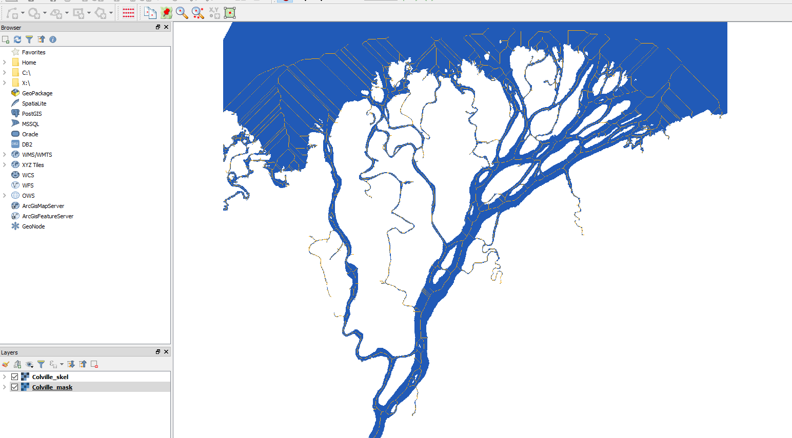
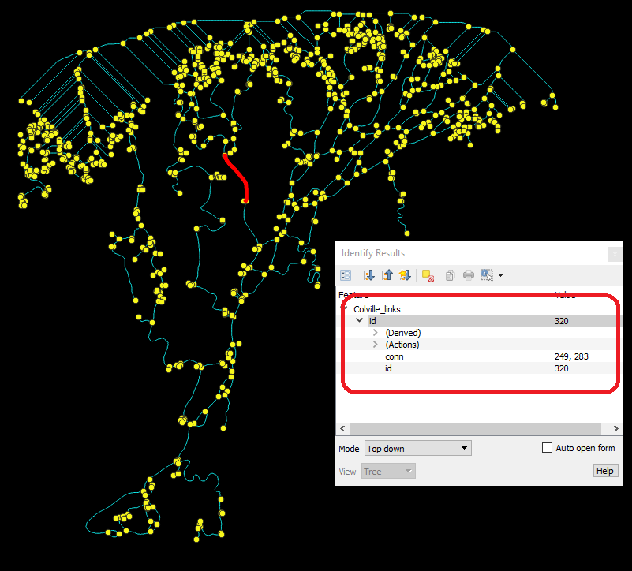
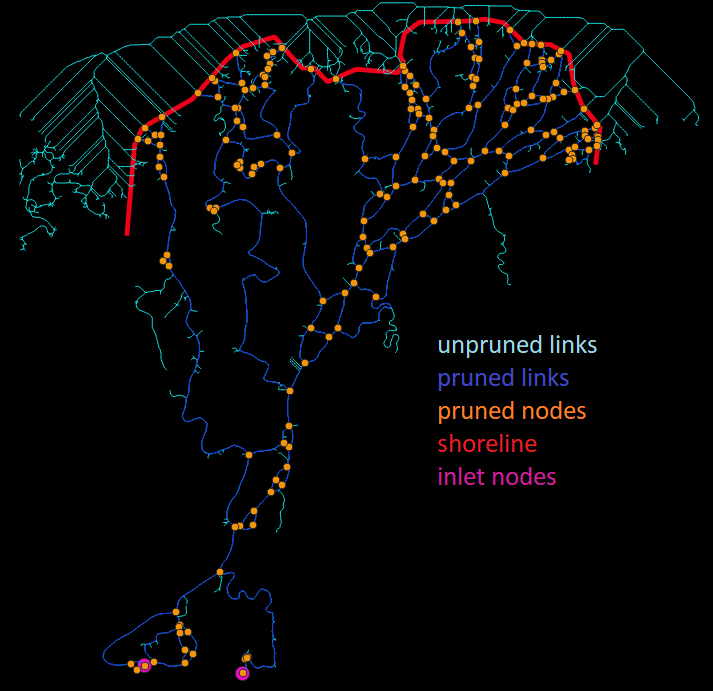

Colville delta example
======================

This page is a guide to the canonical delta notebook rather than a second, independently maintained tutorial.
For the full runnable workflow, open:

::

   examples/delta_example.ipynb

Dataset and paths
-----------------

The example uses the Colville Delta sample data shipped with the repository:

::

   examples/data/Colville_Delta/

The notebook writes outputs to:

::

   examples/data/Colville_Delta/Results/

What the notebook covers
------------------------

The notebook walks through the standard delta workflow:

1. instantiate :class:`rivgraph.classes.delta`
2. skeletonize the binary mask
3. compute the links and nodes
4. provide shoreline and inlet-node vectors, then prune the network
5. compute widths and lengths
6. assign flow directions
7. export georeferenced outputs and inspect results
8. compute delta metrics

Required inputs for delta workflows
-----------------------------------

A delta workflow needs:

- a binary mask, preferably a georeferenced GeoTIFF in a projected CRS
- a shoreline vector for identifying outlet locations
- an inlet-node vector marking the inlet side of the network

The vector inputs do not need to be shapefiles specifically. Any format readable by GeoPandas is acceptable,
though GeoPackage is the recommended general-purpose format for RivGraph outputs.

Current export behavior
-----------------------

In the refactored v1 workflow, :meth:`rivgraph.classes.rivnetwork.to_geovectors` defaults to GeoPackage
(``ftype='gpkg'``). GeoJSON export is still supported, but it requires EPSG:4326 coordinates unless you pass
``reproject=True``. Shapefile export remains available but is the least capable option because of field-name and
schema limitations.

Related documentation
---------------------

- :doc:`../../quickstart/index`
- :doc:`../../shoreline/index`
- :doc:`../../maskmaking/index`
- :doc:`../../apiref/rivgraph`

Selected views from the example
-------------------------------

   The georeferenced mask and skeleton loaded in QGIS.

   The initial extracted network before shoreline-based pruning.

   The network after shoreline and inlet-node pruning.
