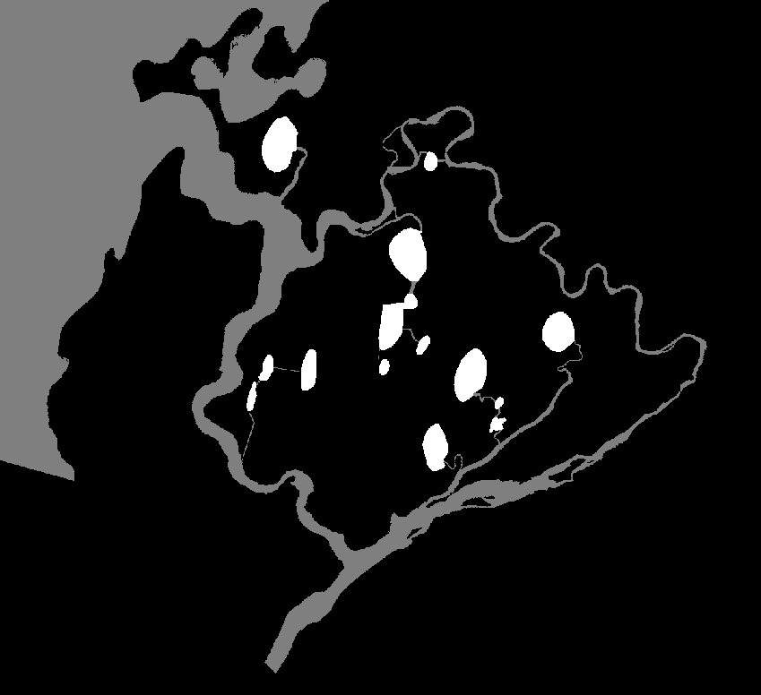

.. _featuredevelopment:

Feature Development
===================

There’s always more to be done! The features listed below are
suggestions that require some significant amount of development. If
you’re interested in tackling, or helping tackle, any of these, please
email j………k@gmail.com and we’ll add you to the RivGraph slack channel to
start discussions.

Automatic Shoreline Extraction
------------------------------

Currently, users must provide their own shoreline file for each delta
they wish to analyze. While the strategy for creating shorelines is
documented (see :doc:`/shoreline/index`),
a preferable option would have RivGraph automatically generate
shorelines. There have been a number of published softwares that attempt
to solve this problem (e.g. opening-angle method), but in practice these
have been found to be too slow and/or need finegaling to interface with
RivGraph.

Lake/wetland connectivity
-------------------------

Many deltas, especially Arctic ones, are lake-dense, and the
connectivity of these lakes has implications for biogeochemical cycling
and transport times of water and sediment. We have spent a few weeks
developing a ``rivgraph-lakes`` branch that attempts to resolve lake
connectivity. However, it’s a difficult problem and we didn’t quite
cross the finish line.

   An example mask with labeled channel network (gray) and lakes (white).

In this formulation, a lake mask would be provided in conjunction with
the river mask, or lakes would be labeled distinctly in a river mask, as
shown by the above mask. The difficulties here lie in the number of ways
lakes can be connected; the figure shown is a rather simple case, but
sometimes lakes themselves intersect both the channel network *and* the
ocean/draining body. The many possibilities make simply resolving their
position within the channel network a formidable task.

The second major issue arises when trying to set flow directions. Are
lakes sources, sinks, or both? The flow directionality algorithms need
to know! And they need to be adapted accordingly. We have made
significant progress on this feature, but it is not ready for
Production.

Another point to mention here is that while we are focusing on lakes
here, the concept may be more generally applicable. For example, if a
user also had a mask of wetlands–or any objects that are connected to
the channel network, this framework could handle those cases.

Machine Learned Flow Directions
-------------------------------

The current scheme for `setting flow
directions <https://esurf.copernicus.org/articles/8/87/2020/>`__ in the
links of a channel network is quite complicated. It is
“physically-based” in the sense that the rules defining flow directions
have physical bases. There are two “hard” constraints–1) there can be no
interior sources or sinks and 2) there can be no cycles (although this
can be violated if RivGraph cannot find a cycle-less solutions).

The paper (and attached dataset) linked above contains plenty of
“training data” that could be used to take a machine learning approach
to set flow directions. Many of the algorithms in place, for example
determining if a link is part of a “main channel,” or
synthetically-generated slopes, can be used to generate the features of
an AI approach. It’s not clear to me how you would enforce the
constraints listed above, but I’ll bet it could be done. Another
difficulty might be that in the “physically-based” scheme, directions
are set iteratively starting with the most certain. By setting a link,
that information is useful in setting its neighbors’ directions, and
so-on. Continuity can only be exploited when only one link (in a group
of adjacent links) has an unknown direction. I would therefore guess
that a ML model would have to follow a similar iterative path.

However, who knows? An AI approach could be faster, especially for the
larger deltas. Post-processing corrections would also be useful (for
either approach, really).

Flow Direction Uncertainty
--------------------------

Many links’ flow directions are not certain and may in fact be
bidirectional. One approached proposed to handle this is: rather than
export a single adjacency matrix with RivGraph’s “best guess,” we could
export a family of adjacency matrices. Alej Tejedor has done some recent
work on the concept of “effective resolution”–i.e. the resolution of the
underlying mask at which graph-based flux partitioning is significantly
impacted (as we coarsen the mask). This concept could be combined with
the family of adjacency matrices to prevent the family from being huge.
In other words, “effective resolution” could prune links that don’t
contribute much to flux routing–and these links are typically the most
uncertain.
