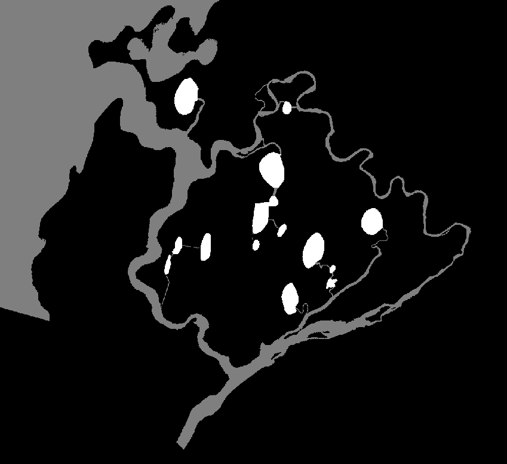

.. _featuredevelopment:

===================
Feature development
===================

This page tracks a few larger ideas that are still open for future development.
These are not part of the core v1 release, but they are promising directions if you are looking for a substantial contribution.

Automatic shoreline extraction
------------------------------

Delta workflows currently require a user-supplied shoreline. While the strategy for creating shorelines is documented in :doc:`/shoreline/index`, a built-in shoreline generator would make delta workflows much easier to automate.

Several published methods, such as opening-angle approaches, exist for this problem. In practice, the challenge is less about generating a coastline-like line and more about producing a robust line that intersects outlet links cleanly and works well with RivGraph's pruning logic.

Lake and wetland connectivity
-----------------------------

Many deltas, especially Arctic ones, are rich in lakes and wetlands. Their connectivity has implications for routing, transport times, and biogeochemical exchange. Extending RivGraph to represent connected non-channel water bodies remains an interesting but difficult problem.

   An example mask with labeled channel network (gray) and lakes (white).

A future implementation would likely allow a second mask, or additional labels within a mask, to represent lakes or wetlands connected to the channel network. The hard parts are topology and directionality: such features can behave as sources, sinks, storage, or bidirectional connectors depending on the application.

Machine-learned flow directions
-------------------------------

The current scheme for `setting flow directions <https://esurf.copernicus.org/articles/8/87/2020/>`__ is rule-based and physically motivated. A machine-learned alternative could be interesting, especially if it used the existing algorithms as feature generators or weak labels.

The main challenge is that flow-direction assignment is constrained: interior sinks and sources are generally not allowed, and cycles must be handled carefully. Any learned approach would likely need to preserve those network-level constraints rather than treating each link independently.

Flow-direction uncertainty
--------------------------

Some links have genuinely uncertain or bidirectional flow. One possible extension would be to represent that uncertainty explicitly rather than exporting only a single best-guess adjacency matrix.

A useful approach might be to export a family of plausible adjacency matrices, ideally paired with a strategy to prune links that have little influence on flux routing so the uncertainty representation stays manageable.
