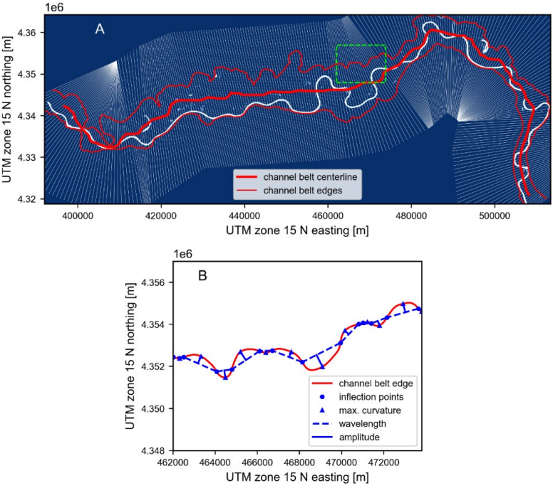

.. DO NOT EDIT.
.. THIS FILE WAS AUTOMATICALLY GENERATED BY SPHINX-GALLERY.
.. TO MAKE CHANGES, EDIT THE SOURCE PYTHON FILE:
.. "gallery/dong2022.py"
.. LINE NUMBERS ARE GIVEN BELOW.

.. only:: html

    .. note::
        :class: sphx-glr-download-link-note

        Click :ref:`here <sphx_glr_download_gallery_dong2022.py>`
        to download the full example code

.. rst-class:: sphx-glr-example-title

.. _sphx_glr_gallery_dong2022.py:

Quantitative relationships between river and channel-belt planform patterns 
=============================================================================
*Tian Dong and Timothy Goudge*

`This publication <https://pubs.geoscienceworld.org/gsa/geology/article/doi/10.1130/G49935.1/614344/Quantitative-relationships-between-river-and>`_
used RivGraph to find channel centerlines, widths, and number of channels en
route to finding new relationships between river planforms and their channel
belts.

.. GENERATED FROM PYTHON SOURCE LINES 13-14

.. code-block:: default

    # Using RivGraph to determine a centerline and its transects along the Missouri 
    # River. (B) shows planform metrics measured along the channel.

.. rst-class:: sphx-glr-timing

   **Total running time of the script:** ( 0 minutes  0.000 seconds)

.. _sphx_glr_download_gallery_dong2022.py:

.. only:: html

  .. container:: sphx-glr-footer sphx-glr-footer-example

    .. container:: sphx-glr-download sphx-glr-download-python

      :download:`Download Python source code: dong2022.py <dong2022.py>`

    .. container:: sphx-glr-download sphx-glr-download-jupyter

      :download:`Download Jupyter notebook: dong2022.ipynb <dong2022.ipynb>`

.. only:: html

 .. rst-class:: sphx-glr-signature

    `Gallery generated by Sphinx-Gallery <https://sphinx-gallery.github.io>`_
