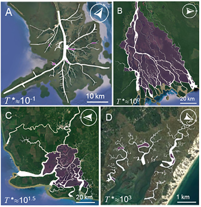

.. DO NOT EDIT.
.. THIS FILE WAS AUTOMATICALLY GENERATED BY SPHINX-GALLERY.
.. TO MAKE CHANGES, EDIT THE SOURCE PYTHON FILE:
.. "gallery/konkol2022.py"
.. LINE NUMBERS ARE GIVEN BELOW.

.. only:: html

    .. note::
        :class: sphx-glr-download-link-note

        Click :ref:`here <sphx_glr_download_gallery_konkol2022.py>`
        to download the full example code

.. rst-class:: sphx-glr-example-title

.. _sphx_glr_gallery_konkol2022.py:

Interplay of river and tidal forcings promotes loops in coastal channel networks
================================================================================
*Adam Konkol, Jon Schwenk, Eleni Katifori, and John Shaw*

`This publication <https://agupubs.onlinelibrary.wiley.com/doi/pdf/10.1029/2022GL098284>`_
used RivGraph to determine the "loopiness" of 21 natural delta channel networks.

.. GENERATED FROM PYTHON SOURCE LINES 11-13

.. code-block:: default

    # RivGraph was used to find loops in channel networks.
    # Here, islands enclosed by loops are colored purple.
    # (A) Mississppi, (B) Orinoco, (C) Rajang, (D) Barnstable Marsh

.. rst-class:: sphx-glr-timing

   **Total running time of the script:** ( 0 minutes  0.000 seconds)

.. _sphx_glr_download_gallery_konkol2022.py:

.. only:: html

  .. container:: sphx-glr-footer sphx-glr-footer-example

    .. container:: sphx-glr-download sphx-glr-download-python

      :download:`Download Python source code: konkol2022.py <konkol2022.py>`

    .. container:: sphx-glr-download sphx-glr-download-jupyter

      :download:`Download Jupyter notebook: konkol2022.ipynb <konkol2022.ipynb>`

.. only:: html

 .. rst-class:: sphx-glr-signature

    `Gallery generated by Sphinx-Gallery <https://sphinx-gallery.github.io>`_
