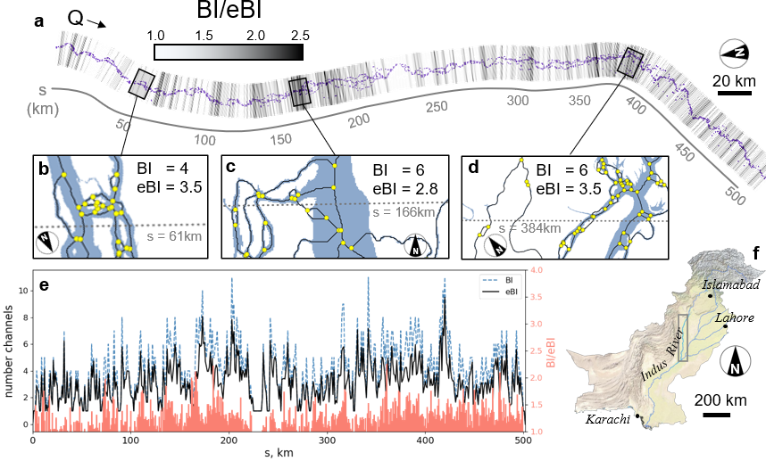

.. DO NOT EDIT.
.. THIS FILE WAS AUTOMATICALLY GENERATED BY SPHINX-GALLERY.
.. TO MAKE CHANGES, EDIT THE SOURCE PYTHON FILE:
.. "gallery/tejedor2022.py"
.. LINE NUMBERS ARE GIVEN BELOW.

.. only:: html

    .. note::
        :class: sphx-glr-download-link-note

        Click :ref:`here <sphx_glr_download_gallery_tejedor2022.py>`
        to download the full example code

.. rst-class:: sphx-glr-example-title

.. _sphx_glr_gallery_tejedor2022.py:

The Entropic Braiding Index (eBI): a robust metric to account for the diversity of channel scales in multi-thread rivers
========================================================================================================================
*Alejandro Tejedor, Jon Schwenk, Maarten Kleinhans, Ajay B. Limaye,
Lawrence Vulis, Paul Carling, Holger Kantz, Efi Foufoula-Georgiou*

`This publication <https://agupubs.onlinelibrary.wiley.com/doi/abs/10.1029/2022GL099681>`_
used RivGraph to extract channel counts and widths in order to present and test
a new index of river multithreadedness

.. GENERATED FROM PYTHON SOURCE LINES 13-14

.. code-block:: default

    # RivGraph was applied to the Indus River to compute the Braiding Index (BI) and
    # the new Entropic Braiding Index (eBI) at various cross sections.

.. rst-class:: sphx-glr-timing

   **Total running time of the script:** ( 0 minutes  0.000 seconds)

.. _sphx_glr_download_gallery_tejedor2022.py:

.. only:: html

  .. container:: sphx-glr-footer sphx-glr-footer-example

    .. container:: sphx-glr-download sphx-glr-download-python

      :download:`Download Python source code: tejedor2022.py <tejedor2022.py>`

    .. container:: sphx-glr-download sphx-glr-download-jupyter

      :download:`Download Jupyter notebook: tejedor2022.ipynb <tejedor2022.ipynb>`

.. only:: html

 .. rst-class:: sphx-glr-signature

    `Gallery generated by Sphinx-Gallery <https://sphinx-gallery.github.io>`_
