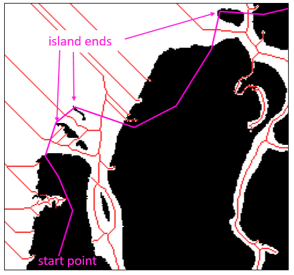

.. _shoreline:

============================
Shoreline creation
============================

Every delta analyzed by *RivGraph* requires that the user create a shoreline as well. This shoreline is used to determine the location of the outlet nodes of the network. Here, guidance is provided for how to create this shoreline for your delta mask.

 - :ref:`whyshoreline`
 - :ref:`howshoreline`

.. _whyshoreline:

------------------------
Purpose of the shoreline
------------------------

Consider the following mask and its skeleton:

.. image:: ../../images/colville_mask_skel.PNG

How can we identify the "ends" of the network--i.e. the outlet locations? There are two options; first, we could manually specify each outlet point individually. This is a viable option, but it is also tedious and does not lend itself well to automation. Instead, *RivGraph* takes a different approach that still requires manual input, but is robust, less tedious, and has the potential for automation.

Instead of placing nodes individually, you will provide a shoreline shapefile (or any geopandas-readable PolyLine). *RivGraph* will intersect your shoreline with the skeleton (actually the vectorized links and nodes that make up the skeleton), place nodes at the connected intersection points, and trim away all the skeleton that lies outside the river network.

.. _howshoreline:

--------------------------
How do I make a shoreline?
--------------------------
There are numerous tools available to generate your shoreline, such as the `Opening Angle Method <http://agupubs.onlinelibrary.wiley.com/doi/abs/10.1029/2008GL033963>`_ or you may automate a procedure. Here, we describe shoreline creation with QGIS, although other GIS software may also be used.

1. Generate the skeleton of your mask.

.. code-block:: python3

   from rivgraph.classes import delta
   mydelta = delta(Mask, path_to_results)
   mydelta.skeletonize()
   mydelta.to_geotiff('skeleton')

*RivGraph* will write your georeferenced skeleton at `path_to_results`.

2. Drag your mask and skeleton into QGIS. You will see something like the above figure.
3. Create a new layer in the ``Layer -> Create Layer -> Create Shapefile Layer`` dropdown.

    * Make sure to select ``Line`` for ``Geometry Type``.

    * Make sure to set the CRS of your new layer to be the same as your mask.

    * Specify a filepath, preferably the same as `path_to_results`, but it can be anywhere.

4. Turn on editing for this layer by clicking the ``Toggle Editing`` icon.
5. Create a new line feature using the ``Add Line Feature`` button.

Now we're at the point of actually drawing the shoreline. Our goal is to intersect all the skeleton links by the shoreline at locations where we'd like outlet nodes to be placed. Identify the first outlet of the mask, and begin drawing shoreline segments across your channels. Here are some tips:

    * The only thing that matters is where your shoreline intersects the outlet links. Don't worry if your shoreline doesn't actually follow the shore.
    * I find it helpful to connect the ends of islands to define where to create shoreline nodes; this typically ensures you're cutting across the correct part of the channel. See the figure below.
    * Make sure your final shoreline cuts the skeleton into two disconnected components.
    * Again, don't worry about intersecting portions of the skeleton other than the outlet links.
    * It gets easier with a little practice, and you may have to iterate a time or two to achieve your desired result.

After we run ``mydelta.prune_network()`` (and specifying the proper paths for the shoreline and inlet nodes) with the shoreline above, we get the following result:

.. image:: ../../images/shoreline_howto2.PNG
  :align: center
.. centered::
  The pruned network is in blue; the outlet nodes are yellow.

Notice that all the spurious skeleton portions have been trimmed, as have all the links in the ocean. We also see outlet nodes have been placed exactly where the shoreline intersected the skeleton.
