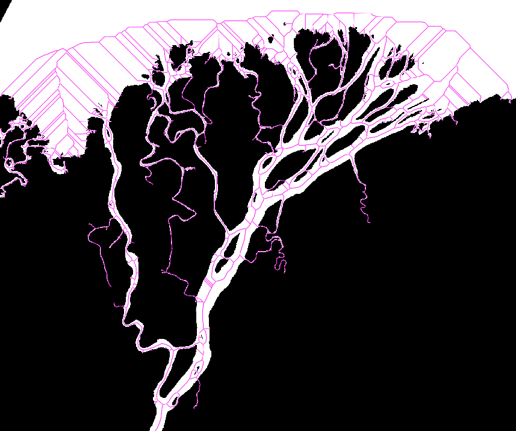
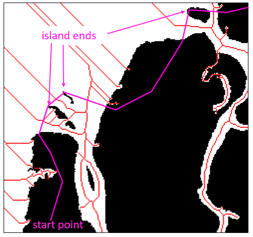
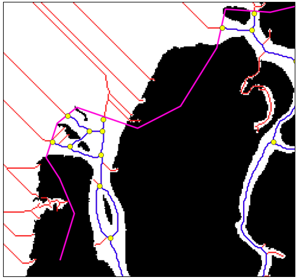

.. _shoreline:

==================
Shoreline creation
==================

Every delta analyzed by *RivGraph* requires a shoreline definition. The shoreline is used to identify
outlet locations and to trim away the connected ocean or lake skeleton that lies outside the actual
delta network.

 - :ref:`whyshoreline`
 - :ref:`howshoreline`

.. _whyshoreline:

------------------------
Purpose of the shoreline
------------------------

Consider the following mask and its skeleton:

How do we identify the outlet side of the network without placing every outlet node by hand? RivGraph uses
a shoreline vector that intersects the outlet links. During pruning, RivGraph intersects that shoreline with
the vectorized skeleton, places outlet nodes at the relevant intersections, and trims away the skeleton that
lies outside the river network.

The shoreline file does not need to be a shapefile specifically. Any GeoPandas-readable line dataset is fine.
For long-term storage and export, GeoPackage is generally the most robust option.

.. _howshoreline:

--------------------------
How do I make a shoreline?
--------------------------

There are numerous tools available to generate a shoreline, such as the `Opening Angle Method <http://agupubs.onlinelibrary.wiley.com/doi/abs/10.1029/2008GL033963>`_,
or you can digitize one manually. Here, we describe a simple QGIS-based workflow.

1. Generate the skeleton of your mask.

.. code-block:: python

   from rivgraph.classes import delta

   mydelta = delta(
       name="MyDelta",
       path_to_mask="/path/to/mask.tif",
       results_folder="/path/to/results",
       verbose=True,
   )
   mydelta.skeletonize()
   mydelta.to_geotiff("skeleton")

RivGraph will write the georeferenced skeleton into the results folder.

2. Drag your mask and skeleton into QGIS.
3. Create a new line layer.

   * Make the geometry type ``Line``.
   * Use the same CRS as the mask.
   * Save it somewhere convenient, ideally in the same results folder.

4. Turn on editing for the new layer.
5. Draw the shoreline so it intersects the outlet links.

Tips for drawing the shoreline:

- The important part is where the shoreline intersects outlet links, not whether it visually hugs the coast.
- Connecting the ends of islands is often a good way to cut across the correct part of the outlet region.
- The final shoreline should split the skeleton into two disconnected components.
- Avoid placing the shoreline directly through interior nodes when possible.

After running ``mydelta.prune_network()`` with the shoreline and inlet-node inputs, you should get something like this:

.. centered::
  The pruned network is in blue; the outlet nodes are yellow.

Notice that the spurious offshore skeleton has been removed and outlet nodes have been placed where the shoreline intersects the network.
